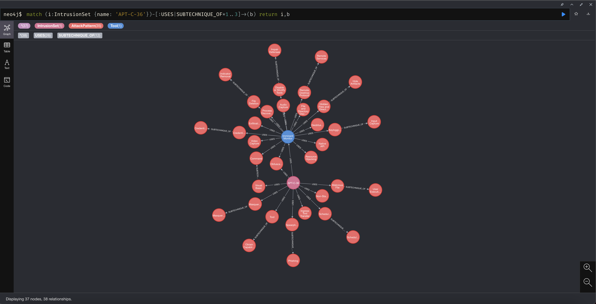

# Neo4j Mitre Poc

This project is a graph database proof of concept using neo4j and mitre.



## Usage

1. Download neo4j docker image from https://hub.docker.com/_/neo4j

```sh
docker pull neo4j
```

1. Start the neo4j database without a volume. This means the data will not be persistet after the database is stopped,
as this is better for development / testing.

```sh
docker run \
  --publish=7474:7474 --publish=7687:7687 \
  --env=NEO4J_AUTH=none \
  --name neo4j \
  --rm \
  neo4j
```

1. Download the mitre json file

```sh
npm run fetch:mitre
```

1. Populate data into the database. This might take a while.

```sh
npm run populate
```

1. Login at http://localhost:7474 with no authentication to run queries

Happy hacking :)

## Sample Queries

To get a list of the sample queries, run `npm run query:dry`. This will print all the queries to the console.
You can then copy them into the UI to visually see the results.
